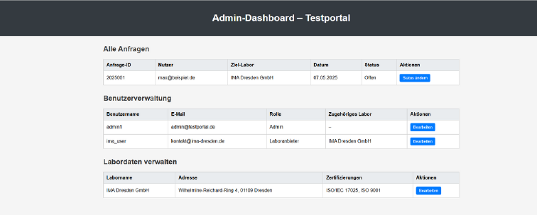
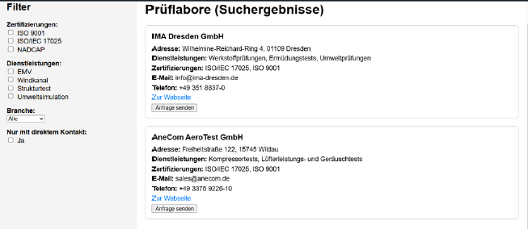

# Laboratory--Testbed-Management-Portal


A centralized online platform for managing, publishing, and booking laboratory test environments and measurement systems.

A centralized online platform for managing, publishing, and booking laboratory test environments and measurement systems.

---

## 🚀 Features

- 🔍 **Smart Search & Filter** for testbeds based on:
- 
  - Test type
  - Location
  - Certification
  - Availability

- 🧪 **Testbed Management** for lab providers:
  - Add and update test environments
  - Attach measurement devices and supporting systems
  - Manage technical specifications and availability

- 📩 **Booking & Request System** for users:
  - Submit booking requests directly to lab providers
  - Track booking status (pending, approved, completed)
  - Contact labs or administrators via request forms

- 👥 **Role-based Dashboard**:
  - Separate interfaces for users, providers, and administrators
  - Overview of testbeds, bookings, and system activity

- 📊 **Admin Control Panel**:
  - Validate new entries
  - Monitor system status and data integrity
  - Manage users and permissions

---

## 🛠️ Tech Stack

- **Frontend:** React, Tailwind CSS
- **Backend:** Python, Django
- **Database:** PostgreSQL
- **Auth & Roles:** Django Auth, Role-based Access Control (RBAC)
- **APIs:** RESTful

---

## 🧱 Data Model Overview

Main entities:

- `Testbed`
- `TestbedType` (Prüfstandsart)
- `MeasuringDevice`
- `SupportingSystem`
- `Booking`
- `User`
- `Certificate`
- `MaintenanceLog`

Each testbed is linked to providers, devices, supporting systems, and booking requests.

---

## 📦 Installation

```bash
git clone https://github.com/yourname/ertemes.git
cd ertemes
pip install -r requirements.txt
python manage.py migrate
python manage.py runserver
